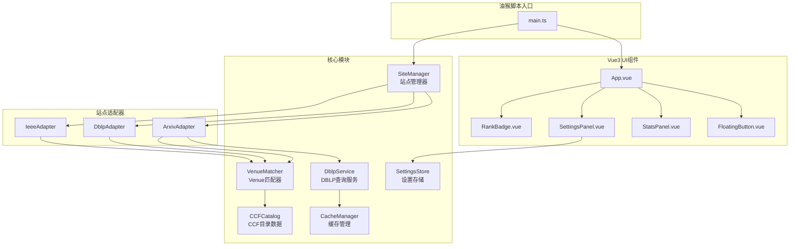

# Design Document

## Overview

本设计文档描述了使用 vite-plugin-monkey + Vue3 开发的统一 CCF 等级显示油猴脚本的技术架构和实现方案。该脚本采用模块化设计，通过适配器模式支持多个学术网站，使用 Vue3 组件化构建 UI，并通过响应式状态管理实现数据流转。

## Architecture



## Components and Interfaces

### 1. 核心模块

#### CCFCatalog (ccf-catalog.ts)

```typescript
interface CCFEntry {
  name: string;           // 规范名称
  abbr: string;           // 缩写
  rank: 'A' | 'B' | 'C';  // CCF等级
  type: 'journal' | 'conference';
  category: string;       // 分类（如：人工智能、软件工程）
  aliases: string[];      // 别名列表
}

interface CCFCatalog {
  entries: Map<string, CCFEntry>;
  
  // 通过缩写或名称查找
  findByKey(key: string): CCFEntry | null;
  
  // 获取所有条目
  getAllEntries(): CCFEntry[];
  
  // 按等级筛选
  getByRank(rank: 'A' | 'B' | 'C'): CCFEntry[];
}
```

#### VenueMatcher (venue-matcher.ts)

```typescript
interface MatchResult {
  matched: boolean;
  entry: CCFEntry | null;
  confidence: 'exact' | 'cleaned' | 'partial' | 'acronym' | 'none';
  originalVenue: string;
  cleanedVenue: string;
}

interface VenueMatcher {
  // 匹配venue字符串
  match(venue: string): MatchResult;
  
  // 清理venue字符串
  cleanVenue(venue: string): string;
  
  // 生成首字母缩写
  generateAcronym(venue: string): string;
}
```

#### DblpService (dblp-service.ts)

```typescript
interface DblpResult {
  found: boolean;
  venue: string | null;
  year: string | null;
  dblpUrl: string | null;
}

interface DblpService {
  // 通过标题查询
  queryByTitle(title: string): Promise<DblpResult>;
  
  // 批量查询（带限流）
  queryBatch(titles: string[]): Promise<Map<string, DblpResult>>;
}
```

#### CacheManager (cache-manager.ts)

```typescript
interface CacheManager {
  // 获取缓存
  get<T>(key: string): T | null;
  
  // 设置缓存
  set<T>(key: string, value: T, ttl?: number): void;
  
  // 删除缓存
  delete(key: string): void;
  
  // 清空所有缓存
  clear(): void;
}
```

#### SettingsStore (settings-store.ts)

```typescript
interface Settings {
  // 显示设置
  showRanks: {
    A: boolean;
    B: boolean;
    C: boolean;
    unknown: boolean;
  };
  
  // 站点开关
  enabledSites: {
    arxiv: boolean;
    dblp: boolean;
    ieee: boolean;
  };
  
  // 显示位置
  badgePosition: 'after-title' | 'after-authors' | 'inline';
  
  // 调试模式
  debugMode: boolean;
  
  // 统计面板默认展开
  statsExpanded: boolean;
}

interface SettingsStore {
  settings: Ref<Settings>;
  
  // 加载设置
  load(): Promise<void>;
  
  // 保存设置
  save(): Promise<void>;
  
  // 重置为默认
  reset(): void;
}
```

### 2. 站点适配器

#### SiteAdapter 基类接口

```typescript
interface PaperInfo {
  id: string;              // 唯一标识
  title: string;           // 论文标题
  venue: string | null;    // 提取到的venue
  venueSource: 'comment' | 'dblp' | 'page' | 'unknown';
  element: HTMLElement;    // DOM元素引用
  insertionPoint: HTMLElement; // Badge插入点
}

interface SiteAdapter {
  // 站点标识
  readonly siteId: string;
  
  // 匹配的URL模式
  readonly urlPatterns: RegExp[];
  
  // 检查当前页面是否匹配
  isMatch(url: string): boolean;
  
  // 获取页面上的论文列表
  getPapers(): PaperInfo[];
  
  // 处理单个论文元素
  processPaper(element: HTMLElement): PaperInfo | null;
  
  // 获取Badge插入点
  getInsertionPoint(paper: PaperInfo): HTMLElement;
  
  // 监听页面变化
  observeChanges(callback: () => void): void;
  
  // 停止监听
  disconnect(): void;
}
```

#### ArxivAdapter

```typescript
class ArxivAdapter implements SiteAdapter {
  siteId = 'arxiv';
  urlPatterns = [
    /arxiv\.org\/search/,
    /arxiv\.org\/list/
  ];
  
  // 从comments解析venue
  parseVenueFromComments(text: string): string | null;
}
```

#### DblpAdapter

```typescript
class DblpAdapter implements SiteAdapter {
  siteId = 'dblp';
  urlPatterns = [
    /dblp\.org\/search/,
    /dblp\.org\/db\//,
    /dblp\.org\/pid\//
  ];
  
  // 从venue链接提取
  extractVenueFromLink(element: HTMLElement): string | null;
}
```

#### IeeeAdapter

```typescript
class IeeeAdapter implements SiteAdapter {
  siteId = 'ieee';
  urlPatterns = [
    /ieeexplore\.ieee\.org\/search/,
    /ieeexplore\.ieee\.org\/author/
  ];
  
  // 从publication元素提取
  extractVenueFromPublication(element: HTMLElement): string | null;
}
```

### 3. 站点管理器

```typescript
interface SiteManager {
  // 注册适配器
  registerAdapter(adapter: SiteAdapter): void;
  
  // 获取当前站点适配器
  getCurrentAdapter(): SiteAdapter | null;
  
  // 处理当前页面
  processCurrentPage(): void;
  
  // 获取处理结果
  getResults(): Map<string, PaperInfo & { matchResult: MatchResult }>;
}
```

### 4. Vue3 UI组件

#### RankBadge.vue Props

```typescript
interface RankBadgeProps {
  rank: 'A' | 'B' | 'C' | null;
  venue: string;
  venueSource: 'comment' | 'dblp' | 'page' | 'unknown';
  confidence: 'exact' | 'cleaned' | 'partial' | 'acronym' | 'none';
  dblpUrl?: string;
  loading?: boolean;
  error?: string;
}
```

#### SettingsPanel.vue

```typescript
// 使用 SettingsStore 进行双向绑定
// 提供保存/重置按钮
```

#### StatsPanel.vue

```typescript
interface StatsData {
  total: number;
  byRank: {
    A: number;
    B: number;
    C: number;
    unknown: number;
  };
}
```

## Data Models

### CCF目录数据结构

```typescript
// 存储在 src/data/ccf-catalog.json
{
  "version": "2022",
  "lastUpdated": "2024-01-01",
  "entries": [
    {
      "name": "IEEE Transactions on Pattern Analysis and Machine Intelligence",
      "abbr": "TPAMI",
      "rank": "A",
      "type": "journal",
      "category": "人工智能",
      "aliases": ["tpami", "pami", "ieee transactions on pattern analysis and machine intelligence"]
    }
    // ...
  ]
}
```

### 缓存数据结构

```typescript
// DBLP查询缓存
interface DblpCacheEntry {
  result: DblpResult;
  timestamp: number;
  ttl: number; // 默认7天
}

// 使用 GM_setValue 存储
// key格式: "dblp_cache_{md5(title)}"
```

### 用户设置数据结构

```typescript
// 使用 GM_setValue 存储
// key: "ccf_rank_settings"
interface StoredSettings {
  version: number;
  settings: Settings;
  lastModified: number;
}
```

## Correctness Properties

*A property is a characteristic or behavior that should hold true across all valid executions of a system-essentially, a formal statement about what the system should do. Properties serve as the bridge between human-readable specifications and machine-verifiable correctness guarantees.*

### Property 1: Venue字符串清理一致性

*For any* venue字符串，cleanVenue函数应该移除所有年份（如2024、'23）、卷号（vol.X）、页码（pp.X-Y）、期号（no.X）信息，且清理操作是幂等的（多次清理结果相同）。

**Validates: Requirements 2.5**

### Property 2: CCF等级匹配正确性

*For any* CCF目录中的期刊/会议条目，使用其缩写、全称或任意别名进行匹配，都应该返回正确的CCF等级。

**Validates: Requirements 3.2, 3.3, 3.4, 3.5, 3.6**

### Property 3: 匹配大小写不敏感

*For any* venue字符串，无论其大小写如何变化（全大写、全小写、混合大小写），匹配结果应该相同。

**Validates: Requirements 3.2**

### Property 4: 缓存命中避免重复请求

*For any* 论文标题，第一次DBLP查询后结果应被缓存，后续相同标题的查询应直接返回缓存结果而不发起新请求。

**Validates: Requirements 6.1**

### Property 5: 处理幂等性

*For any* 论文DOM元素，多次调用处理函数应该只添加一个Rank_Badge，不会重复添加。

**Validates: Requirements 6.3**

### Property 6: 统计数据正确性

*For any* 页面上的论文集合，统计面板显示的各等级数量之和应等于总论文数，且各等级百分比之和应为100%（允许舍入误差）。

**Validates: Requirements 7.2, 7.3**

### Property 7: 设置持久化一致性

*For any* 用户设置修改，保存后重新加载应该得到相同的设置值。

**Validates: Requirements 5.5**

### Property 8: Comments解析覆盖率

*For any* 包含已知会议/期刊名称的arXiv comments字符串（如"Accepted to CVPR 2024"、"Published in NeurIPS"），解析函数应能正确提取venue名称。

**Validates: Requirements 2.1**

## Error Handling

### DBLP服务错误处理

1. **网络错误**: 捕获fetch异常，返回错误状态，UI显示"查询失败"
2. **超时错误**: 使用AbortController设置10秒超时，超时后返回超时状态
3. **解析错误**: 捕获JSON解析异常，记录日志，返回空结果
4. **限流错误**: 检测429状态码，实现指数退避重试

### DOM操作错误处理

1. **元素不存在**: 使用可选链操作符，元素不存在时跳过处理
2. **插入失败**: 捕获DOM操作异常，记录日志，继续处理其他元素
3. **选择器失效**: 使用多个备选选择器，全部失败时记录警告

### 全局错误处理

```typescript
// 在main.ts中设置全局错误处理
window.addEventListener('error', (event) => {
  console.error('[CCF Rank] Uncaught error:', event.error);
  // 不阻止默认行为，避免影响原网站
});

window.addEventListener('unhandledrejection', (event) => {
  console.error('[CCF Rank] Unhandled rejection:', event.reason);
});
```

## Testing Strategy

### 单元测试

使用 Vitest 进行单元测试：

1. **VenueMatcher测试**: 测试各种venue字符串的清理和匹配
2. **CCFCatalog测试**: 测试目录数据的完整性和查询功能
3. **CacheManager测试**: 测试缓存的存取和过期机制
4. **SettingsStore测试**: 测试设置的加载、保存和默认值

### 属性测试

使用 fast-check 进行属性测试：

1. **cleanVenue幂等性**: 生成随机venue字符串，验证多次清理结果一致
2. **匹配大小写不敏感**: 生成随机大小写变体，验证匹配结果一致
3. **统计计算正确性**: 生成随机论文集合，验证统计数据正确

### 组件测试

使用 @vue/test-utils 进行Vue组件测试：

1. **RankBadge渲染**: 测试不同等级的样式渲染
2. **SettingsPanel交互**: 测试设置修改和保存
3. **StatsPanel更新**: 测试统计数据的响应式更新

### E2E测试（可选）

使用 Playwright 进行端到端测试：

1. 在真实网站上测试脚本功能
2. 验证Badge正确显示
3. 验证设置面板功能

